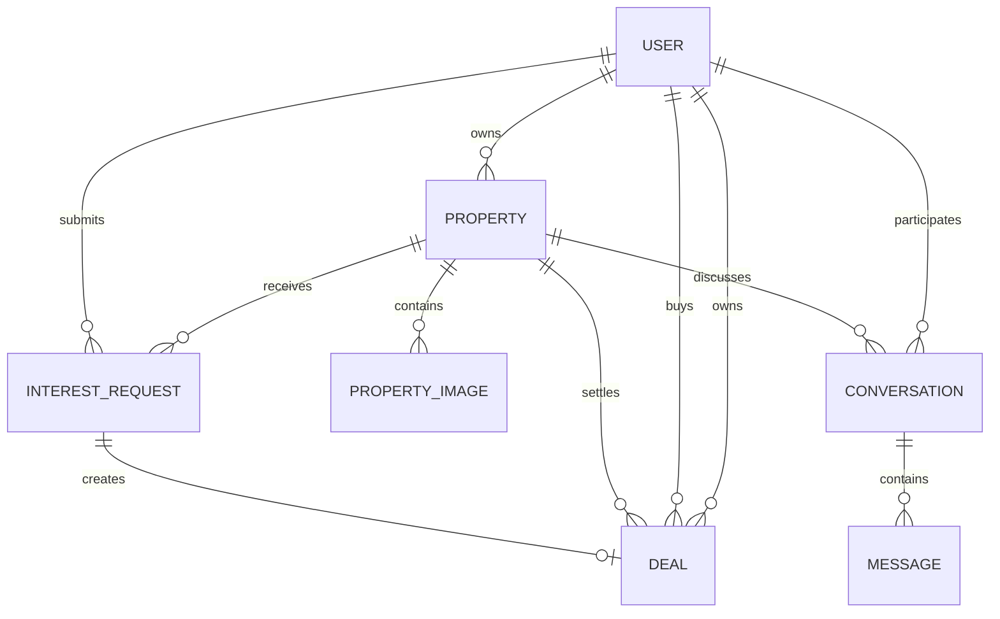

\# NoBroker Clone


A property listing platform with separate property-owner and buyer/tenant roles.


\## Technology


\### Backend

\- Python

\- Django

\- Django REST Framework

\- PostgreSQL

\- Django Channels and Daphne for WebSockets

\- Redis channel layer


\### Frontend

\- React

\- Vite


\## Project Structure


\- `apps/users/` — user and authentication functionality

\- `apps/properties/` — property listings and interest requests

\- `apps/chat/` — conversations and messaging

\- `apps/deals/` — deal records and status

\- `config/` — Django settings, URLs, and ASGI configuration


\## Local Setup


\### 1. Backend


Open PowerShell and navigate to the backend:


&#x20;   cd D:\\djongproject\\NoBrokerCloneNew


Create and activate a virtual environment if needed:


&#x20;   python -m venv .venv

&#x20;   .\\.venv\\Scripts\\Activate.ps1


Install dependencies:


&#x20;   pip install -r requirements.txt


Create a local `.env` file using `.env.example` as a template.

Set your own secret key and PostgreSQL connection details.


Apply migrations:


&#x20;   python manage.py migrate


Start Django:


&#x20;   python manage.py runserver


\### 2. Frontend


Open another PowerShell terminal:


&#x20;   cd D:\\djongproject\\nobroker-frontend


Install dependencies:


&#x20;   npm install


Start the development server:


&#x20;   npm run dev


\## Environment Variables


See `.env.example` for the variable names and placeholder values.


Never commit real passwords, secret keys, or other credentials.


\## Features


Implemented features should be verified against the current application before release.

## Architecture

The Django project exposes REST endpoints under `/api/` and serves media files in development. React and Vite provide the browser application. JWT access tokens authenticate API requests. Django Channels and Daphne provide the WebSocket chat transport; Redis is used as the channel layer when configured.

The frontend uses service functions in `nobroker-frontend/src/services/api.js` and route-level React pages. Owner and buyer permissions are enforced by both API views and the UI.

## Core API Endpoints

| Area | Methods and endpoint |
| --- | --- |
| Auth | `POST /api/users/register/`, `POST /api/users/login/`, `POST /api/users/token/refresh/`, `GET /api/users/me/` |
| Properties | `GET, POST /api/properties/`, `GET, PATCH, PUT, DELETE /api/properties/<id>/`, `GET /api/properties/mine/` |
| Search | `GET /api/properties/?city=&listing_type=&property_type=&bedrooms=&min_price=&max_price=&sort=&page=&page_size=` |
| Images | `POST /api/properties/<id>/images/` |
| Interests | `GET /api/properties/interests/`, `GET /api/properties/interests/mine/`, `PATCH /api/properties/interests/<id>/` |
| Deals | `GET /api/deals/`, `POST /api/deals/create/`, `GET, PATCH /api/deals/<id>/` |
| Chat | `GET, POST /api/chat/conversations/`, `GET /api/chat/conversations/<id>/`, `GET, POST /api/chat/conversations/<id>/messages/` |

Deal creation requires an accepted interest and an owner. Only the owner can complete or cancel an active deal. Completion records `completed_at` and changes the property to `SOLD` or `RENTED`.

## Database Schema



## Design Decisions

- The API is the authority for role checks and deal state transitions; UI controls are convenience, not security.
- A deal is one-to-one with an accepted interest to prevent duplicate transactions.
- Property availability is updated atomically with deal completion so a property cannot be completed twice.
- Search pagination is opt-in through `page` and `page_size`, preserving the simple list response for callers that do not need pagination.
- Media uploads happen after property creation because the image endpoint requires a property id.

## Verification

From the backend directory:

```powershell
python manage.py check
python manage.py migrate
python manage.py runserver
```

From the frontend directory:

```powershell
npm install
npm run dev
```

The current verification includes deal create/complete/cancel API flows, unauthorized deal updates, completed timestamps, SOLD/RENTED availability, property filters, pagination, sorting, invalid search input, owner browser flow, buyer deal history, and frontend production builds. The repository currently has no automated Django test modules; the targeted API checks should be converted into committed tests before production deployment.

## Deployment Checklist

1. Set a unique `SECRET_KEY`, `DEBUG=False`, allowed hosts, database settings, CORS settings, and Redis settings in the deployment environment.
2. Run `python manage.py migrate` and collect static files.
3. Serve Django with Daphne or another production ASGI server and serve the Vite build through a web server.
4. Configure persistent media storage and HTTPS WebSocket forwarding.
5. Confirm `.env`, `db.sqlite3`, `media/`, and credentials are excluded from version control.

